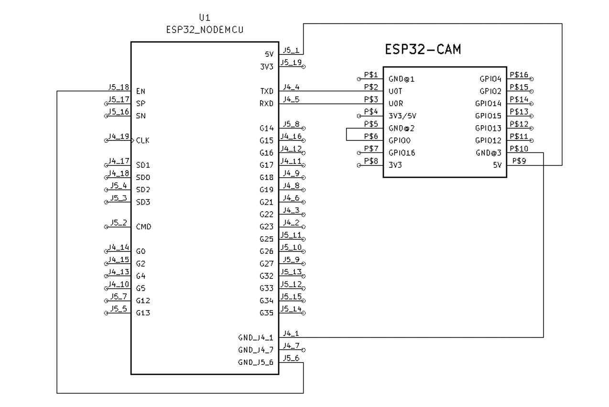
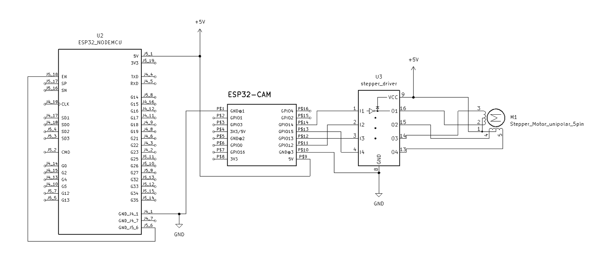
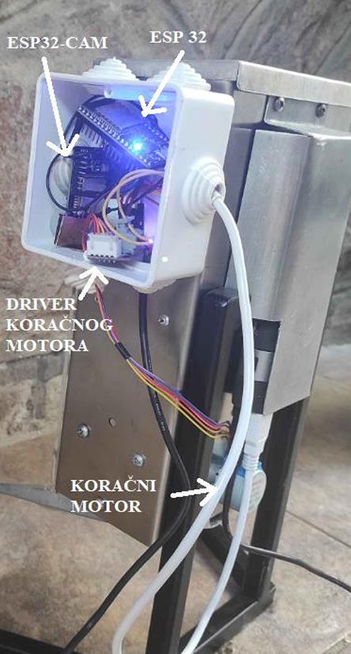

# IoT-Pet-Feeder 

This project is an IoT-based smart feeder for animals that uses image detection to identify animals (birds, dogs, or cats) and dispenses food accordingly.  

## Features  
- **Animal Detection**: The ESP32CAM captures an image, which is sent to a Flask web application for processing.  
- **AI Model Integration**: The Flask app uses a trained model to classify whether the animal is a bird, dog, or cat.  
- **Servo Motor Control**: Based on the detected animal, the web app sends a command to the ESP32CAM to rotate the servo motor for a specific duration, controlling the amount of food dispensed.  

## Technology Stack  
- **Hardware**:  
  - ESP32CAM with a camera module  
  - Servo motor
  - FTDI, ESP32CAM MB or ESP32 for flashing code on ESP32CAM  
- **Software**:  
  - Flask (Web App Backend)  

## How It Works  
1. The ESP32CAM captures an image when an animal approaches.  
2. The image is sent to the Flask web app using the ESP32CAM's IP address.  
3. The Flask app processes the image and determines if it’s a bird, dog, or cat.  
4. Based on the classification, the Flask app sends a command back to the ESP32CAM to activate the servo motor for a specific duration.

## Wiring
**Flashing/Uploading code to ESP32CAM with help of ESP32:**



**Pet Feeder:**



**_Note:_** _Using the ESP32 as the power source for ESP32CAM is not recommended due to potential voltage drops, which can affect performance. For optimal stability, it is advised to connect the camera directly to a dedicated power supply._


## Usage  

1. **Clone the Project**:  
   - Start by cloning this repository to your local machine:  
     ```bash
     git clone https://github.com/adrianhorvat2/IoT-Pet-Feeder.git

2. **Set Up the ESP32CAM**:  
   - Open the Arduino IDE and ensure you have installed the necessary ESP32 board support -> navigate to settings In Additional boards manager URL's paste this URL: https://raw.githubusercontent.com/espressif/arduino-esp32/gh-pages/package_esp32_index.json  
   - Replace the `WiFi SSID` and `Password` in the code with your network credentials.  
   - In the Arduino IDE, select **Tools > Board > ESP32 Wrover Module**.  

4. **Flash the ESP32CAM**:  
   - Connect the ESP32CAM to your computer via an ESP32 (used for flashing in this project), FTDI programmer or ESP32CAM MB.
   - When your code is done uploading on ESP32CAM, disconnect GPIO0 from GND on your ESP32CAM (if you used ESP32 or FTDI to flash code). 
   - Click **Upload** in the Arduino IDE to flash the code to the ESP32CAM.  
   - Put the ESP32CAM into **programming mode** by holding the **boot button** while powering it on.  

5. **Get the Camera's IP Address**:  
   - After flashing  open the **Serial Monitor** in the Arduino IDE (set baud rate to 115200).  
   - Reset the ESP32CAM (**boot button**) and wait for the IP address to appear in the Serial Monitor.  

6. **Update the Flask Web App**:  
   - Open the `app.py` file in your project directory.  
   - Find the `cam_ip` attribute in the configuration section and replace it with the IP address of the ESP32CAM from the Serial Monitor.  

7. **Run the Flask Web App**:  
   - Navigate to the directory containing the `app.py` file.  
   - Start the web app by running the following command:  
     ```bash
     python app.py

8. **Access the Web App**:  
   - Open your web browser and navigate to `http://<your_local_ip>:5000` (replace `<your_local_ip>` with the IP address of the machine running the Flask app).  

9. **System Flow**:  
   - When an animal approaches the ESP32CAM, it captures an image and sends it to the Flask web app.  
   - The web app processes the image, identifies the animal (bird, dog, or cat), and sends a command back to the ESP32CAM to control the servo motor and dispense the appropriate amount of food.  

## Hardware setup


